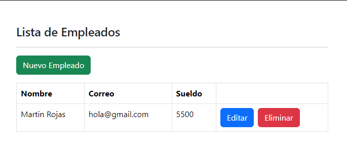

# CRUD con REACT y NET 8 WEB API.

## Descripción 📑 

Aplicacion React que esta conectada a una WEB API desarrollada en .NET 8.

## Paquetes de NuGet utilizados.
- Microsoft.EntityFrameworkCore.SqlServer
- Microsoft.EntityFrameworkCore.Tools

## ¿Qué he aprendido en este proyecto? 🙇🏻  
- Crear WEB API con .NET 8
- Aplicacion de React
- Database First con EntityFramework.
- Contexto para la conexión de la base de datos y la aplicación.
- Utilizar "Scaffold-DbContext".

## Tecnologías 🛠 
<!-- Iconos sacados de: https://github.com/hendrasob/badges/blob/master/README.md y https://github.com/alexandresanlim/Badges4-README.md-Profile -->

## Vista previa del proyecto
Si quieres hechas un vistazo al proyecto, te recomiendo:
### WEB API con .NET 8.

### Pagina principal.

### Crear nuevo empleado.

### Editar empleado.

### Lista de empleados - Eliminando un empleado.

## Autor ✒️
**MARTÍN ROJAS**

* [csamuelr.lp@gmail.com](csamuelr.lp@gmail.com)
* [LinkedIn](https://www.linkedin.com/in/martín-rojas-34b194245/)
* [Porfolio web](https://github.com/retak1ng/martindev.github.io)

<!--
## Instalación 
Este proyecto no necesita de instalación. Simplemente abre la carpeta o haz doble click en el .html

  
## Licencia 📄 
MIT Public License v3.0
No puede usarse comencialmente.
-->